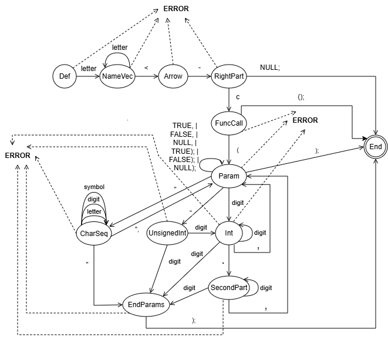
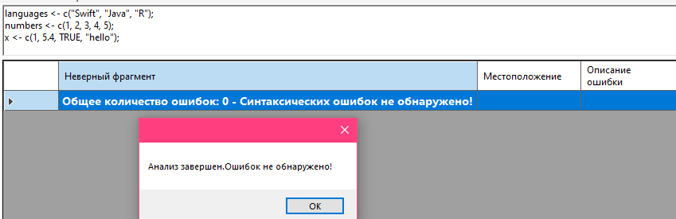
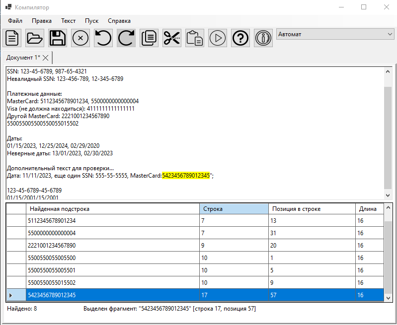
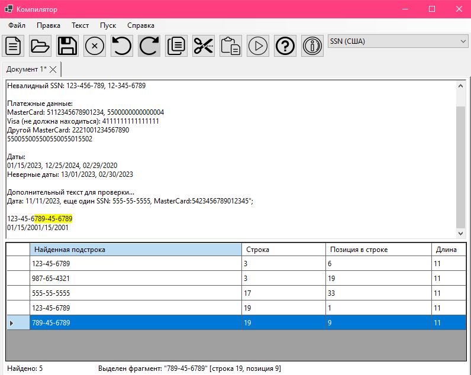
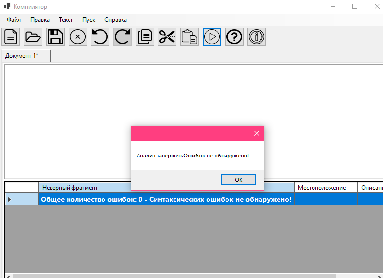
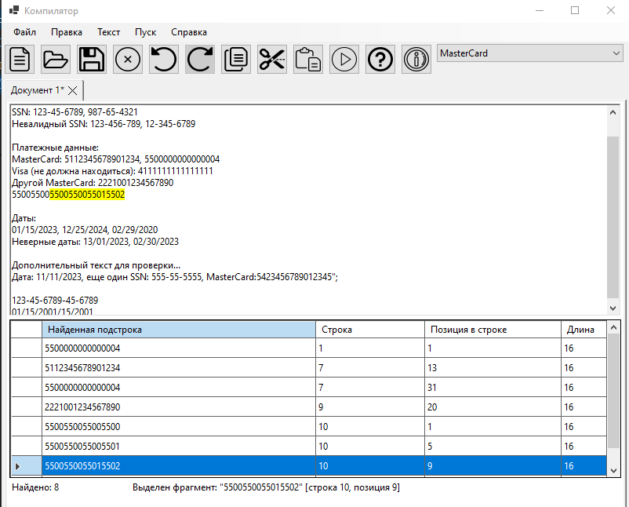
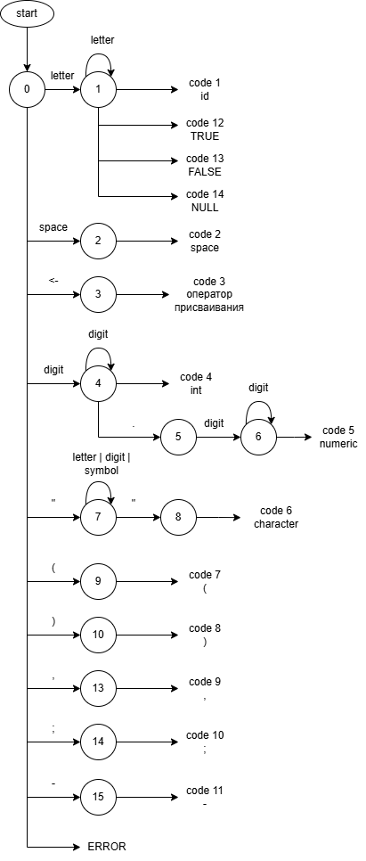

# Лабораторная работа 3. Разработка синтаксического анализатора (парсера)

## Цель работы
Изучить назначение и принципы работы синтаксического анализатора в структуре компилятора. Спроектировать грамматику, построить соответствующую схему метода анализа грамматики и выполнить программную реализацию парсера с нейтрализацией синтаксических ошибок методом Айронса. Интегрировать разработанный модуль в ранее созданный графический интерфейс языкового процессора.

## Сведения об авторе
Автор: студентка группы АВТ-314, Лабузова Виктория Витальевна

## Постановка задачи
Разработать синтаксический анализатор (парсер) в соответствии с индивидуальным вариантом курсовой (расчетно-графической) работы, интегрировать его в приложение из лабораторной работы №1 и обеспечить наглядный вывод результатов анализа. 

## Вариант задания
### Вариант:
28, Объявление вектора на языке R.
Векторы – это фундаментальные структуры данных в языке R, представляющие собой упорядоченные наборы элементов одного типа. Векторы могут содержать числовые, строковые, логические или значения NULL. Объявление векторов в R осуществляется с помощью функции c().
Для описания векторов в языке R используется оператор присваивания <-. Формат записи: «имя_вектора <- выражение;».
Примеры:
1.	Вектор, созданный с помощью конкатенации одного типа данных: «nums <- c(1, 2, 3, 4, 5);». Функция c() объединяет переданные элементы в вектор.
2.	Вектор, созданный с помощью конкатенации разных числовых типов данных: «numbers <- c(1, 2.05, -3, -4342.122, 5);». Функция c() приведет тип данных integer к numeric.
3.	Вектор, созданный с помощью конкатенации разных типов данных: «vec <- c(1, “hello”, TRUE, 4.5, NULL);». Функция c() приведет элементы вектора к наиболее общему типу, в данном случае к character.


### Корректные входные строки:
vec <- c("Swift", TRUE, 1, 2.5, 'hello');

numbers <- c(1, 2, 3.6, 4, 5);

x <- NULL;

### Перечень допустимых лексем:
1. Идентификатор
2. Разделитель (пробел)
3. Оператор присваивания "<-"
4. Целое число без знака (integer)
5. Дробное число без знака (numeric)
6. Символьный тип данных (character)
7. Разделитель (открывающая скобка) "("
8. Разделитель (закрывающая скобка) ")"
9. Разделитель (запятая) ","
10. Конец оператора (точка с запятой) ";"
11. Оператор вычитания (минус) "-"
12. Ключевое слово "TRUE"
13. Ключевое слово "FALSE"
14. Ключевое слово "NULL"

## Разработка грамматики
```
1.	<Def> → <Letter> <NameVec>
2.	<NameVec> → <Letter> <NameVec> | “<” <Arrow>
3.	<Arrow> → “-“ <RightPart>
4.	<RightPart> → “c” <FuncCall> | “NULL;”
5.	<FuncCall> → “(“ <Param> | “();”
6.	<Param> → “-“ <UnsignedInt> | <Digit> <Int> | “"” <CharSeq> | “TRUE,” | “FALSE,” | “NULL,” | “TRUE);” | “FALSE);” | “NULL);”
7.	<UnsignedInt> → <Digit> <Int> | <Digit> <EndParams>
8.	<Int> → <Digit> <Int> | “.” <SecondPart> | <Digit> <EndParams> | “,” <Param>
9.	<SecondPart> → <Digit> <SecondPart> | <Digit> <EndParams> | “,” <Param>
10.	<CharSeq> → <Letter> <CharSeq> | <Digit> <CharSeq> | <Symbol> <CharSeq> | “",” <Param> | “"” <EndParams> 
11.	<EndParams> → “);”
12.	<Letter> → “a” | “b” | ... | “z” | “A” | ... | “Z”
13.	<Digit> → “0” | “1” | ... | “9”
14.	<Symbol> → “ “ | “!” | “@” | “#” | “№” | “`” | “$” | “%” | “^” | “&” | “*” | “(“ | “)” | “-“ | “+” | “=” | “[“ | “]” | “{“ | “}” | “\” | “|” | “;” | “:” | “'” | “,” | “.” | “/” | “?” | “>” | “<” | “~” | “`” | “_”

G = (VN, VT, P, Z)
G[<Z>]:
•	Z = ‹Def›;
•	VT = {a, b, c, ..., z, A, B, C, ..., Z,  , ! , @ , # , $ , % , ^ , & , * , ( , ) , - , + , = , [ , ] , { , } , \ , ; , : , ' , , , . , / , ? , > , < , ~ , ` , _ , 0, 1, 2, ..., 9};
•	VN = {<Def>, <NameVec>, <Arrow>, <RightPart>, <FuncCall>, <Param>, <UnsignedInt>, <Int>, <SecondPart>, <CharSeq>, <EndParams>, <Digit>, <Letter>, <Symbol>}.
```

## Классификация грамматики (по Хомскому)
Согласно классификации Хомского, грамматика G[‹Def›] является автоматной.
Правила (1) – (11) относятся к классу праворекурсивных продукций (A → aB | a | ε):
```
1.	<Def> → <Letter> <NameVec>
2.	<NameVec> → <Letter> <NameVec> | “<” <Arrow>
3.	<Arrow> → “-“ <RightPart>
4.	<RightPart> → “c” <FuncCall> | “NULL;”
5.	<FuncCall> → “(“ <Param> | “();”
6.	<Param> → “-“ <UnsignedInt> | <Digit> <Int> | “"” <CharSeq> | “TRUE” <Param> | “FALSE” <Param> | “NULL” <Param> | “);”
7.	<UnsignedInt> → <Digit> <Int> | <Digit> <EndParams>
8.	<Int> → <Digit> <Int> | “.” <SecondPart> | <Digit> <EndParams> | “,” <Param>
9.	<SecondPart> → <Digit> <SecondPart> | <Digit> <EndParams> | “,” <Param>
10.	<CharSeq> → <Letter> <CharSeq> | <Digit> <CharSeq> | <Symbol> <CharSeq> | “",” <Param> | “"” <EndParams> 
11.	<EndParams> → “);”
12.	<Letter> → “a” | “b” | ... | “z” | “A” | ... | “Z”
13.	<Digit> → “0” | “1” | ... | “9”
14.	<Symbol> → “ “ | “!” | “@” | “#” | “$” | “%” | “^” | “&” | “*” | “(“ | “)” | “-“ | “+” | “=” | “[“ | “]” | “{“ | “}” | “\” | “|” | “;” | “:” | “'” | “,” | “.” | “/” | “?” | “>” | “<” | “~” | “`” | “_”

```
Отметим, что правила должны быть либо только леворекурсивными, либо только праворекурсивными. Комбинация тех и других не допускается. 


## Метод анализа
Граф автоматной грамматики



## Диагностика и нейтрализация синтаксических ошибок
В данной работе используется алгоритм нейтрализации синтаксических ошибок методом Айронса.  
Алгоритм реализован следующим образом:
1. В случае, если парсер находится после открывающей скобки, то есть в списке параметров и ожидался следующий параметр окончание списка параметров, то парсер будет отбрасывать все токены до тех пор, пока не найдет запятую (",") или закрывающую скобку (")").  
После нахождения нужного токена производится проверка, есть ли дальше токены. Если парсер достиг конца строки, то становится активным состояние ошибки.  
Если список токенов еще не окончен, то делается вывод на основе найденного символа:  
Найдена запятая (",") - восстанавливается состояние нахождения в списке параметров (после открывающей скобки и, возможно, после нескольких параметров);  
Найдена закрывающая скобка (")") - активируется состояние ожидания ";", так как список параметров завершен.  
2. В случае, если парсер находится в любом другом состоянии, то парсер будет отбрасывать все токены до тех пор, пока не найдет один из следующих токенов: "<-", "(", ";", ")", ",".  
После нахождения нужного токена производится проверка, есть ли дальше токены. Если парсер достиг конца строки, то становится активным состояние ошибки.  
Если список токенов еще не окончен, то делается вывод на основе найденного символа:  
Найдена точка с запятой (";") - активируется состояние конца строки;
Найден оператор присваивания ("<-") - активируется состояние ожидания идентификатора (функции c()) или NULL;  
Найдена открывающая скобка ("(") или запятая (",") - активируется состояние нахождения в списке параметров. В случае "(" также производится проверка об уже не закрыта ли скобка до этого.;
Найдена закрывающая скобка (")") - активируется состояние ожидания точки с запятой;

## Тестовые примеры
### Корректная строка
languages <- c("Swift", "Java", "R");  
numbers <- c(1, 2, 3, 4, 5);  
x <- c(1, 5.4, TRUE, "hello");  



### Строка с одной ошибкой
languages <- c("Swift" "Java", "R");  
numbers <- c(1, 2, 3, 4, 5);  
x <- c(1, 5.4, TRUE, "hello");  



### Строка с несколькими ошибками
languages <- c("Swift" "Java", "R");  
numbers <- c(1, 2, 3, .4, 5);  
x <- c(1, 5., TRUE,)"hello");  



### Пустая строка


### Строка без первого ключевого слова
<- c("Swift" "Java", "R");  




# Лабораторная работа 2. Разработка лексического анализатора (сканера)

## Цель работы
Изучить назначение и принципы работы лексического анализатора в структуре компилятора. Спроектировать алгоритм (диаграмму состояний) и выполнить программную реализацию сканера для выделения лексем из входного текста. Интегрировать разработанный модуль в ранее созданный графический интерфейс языкового процессора.

## Сведения об авторе
Автор: студентка группы АВТ-314, Лабузова Виктория Витальевна

## Постановка задачи
Разработать лексический анализатор (сканер) в соответствии с индивидуальным вариантом задания, интегрировать его в приложение из лабораторной работы №1 и обеспечить наглядный вывод результатов.  

### Требования к реализации сканера:
Спроектировать диаграмму состояний конечного автомата, реализующего сканер, согласно варианту задания.
Разработать программный модуль лексического анализа, который принимает на вход строку, выделяет допустимые лексемы, классифицирует их и выводит ошибки при наличии с указанием позиции.
  
### Требования к интеграции и интерфейсу:
Встроить сканер в ранее разработанный интерфейс и связать его с кнопкой "Пуск" и соответствующим пунктом меню.
Область вывода результатов должна содержать следующие столбцы: условный код, тип лексемы, лексема и местоположение. При щелчке на сообщение об ошибке курсор переносится на позицию недопустимого символа.

## Вариант задания
### Вариант:
28, Объявление вектора на языке R.

### Корректные входные строки:
vec <- c("Swift", TRUE, 1, 2.5, 'hello');

numbers <- c(1, 2, 3.6, 4, 5);

x <- NULL;

### Перечень допустимых лексем:
1. Идентификатор
2. Разделитель (пробел)
3. Оператор присваивания "<-"
4. Целое число без знака (integer)
5. Дробное число без знака (numeric)
6. Символьный тип данных (character)
7. Разделитель (открывающая скобка) "("
8. Разделитель (закрывающая скобка) ")"
9. Разделитель (запятая) ","
10. Конец оператора (точка с запятой) ";"
11. Оператор вычитания (минус) "-"
12. Ключевое слово TRUE
13. Ключевое слово FALSE
14. Ключевое слово NULL

## Диаграмма состояний


### Краткое описание работы автомата:
Сканер последовательно считывает символы из полученной строки и сопоставляет их со списком допустимых символов. Состояния переключаются на основании текущего прочитанного символа: токен либо увеличивается, либо завершается и состояние переходит к первоначальному. При прочтении недопустимого символа позиция и символ сохраняются с сообщением об ошибке.

## Тестовые примеры
### Корректная строка:
languages <- c("Swift", "Java", "R");


### Строка с недопустимым символом:
numbers <%- c(1№, 2);


### Многострочный пример:
x <- c(1, 5.4, TRUE);
  
x <-1;


# Лабораторная работа 1. Разработка пользовательского интерфейса (GUI) для языкового процессора.  
  
## Цель работы
Создание кроссплатформенного графического интерфейса (GUI) для языкового процессора в виде специализированного текстового редактора.

## Сведения об авторе
Автор: студентка группы АВТ-314, Лабузова Виктория Витальевна
  
## Описание проекта 
Текстовый редактор с возможностью редактирования текстовых документов.
В программе присутствуют функции создания, открытия, сохранения, закрытия файла, есть возможность работы с несколькими файлами одновременно.
Функции правки включают: отмена, возрврат, вырезание, копирование, вставка, удаление, выделение всего текста.
Также есть возможность узнать о программе и ознакомиться с руководством пользователя. 
  
## Используемые технологии 
C#, WinForms.  
  
## Инструкция по сборке и запуску:  
1. Загрузить проект с github в формате ZIP и расархивировать или клонировать при помощи ссылки.  
2. Открыть командную строку. Нажать Win + R, ввести cmd и нажать Enter.  
3. Перейти в папку проекта  
cd \editor  
4. Восстановить зависимости (Зависимостей нет, шаг можно пропустить).  
dotnet restore  
5. Собрать проект.  
dotnet build  
6. Запустить программу с помощью команды  
dotnet run  
Или перейти в папку с exe-файлом и запустить вручную  
cd bin\Debug\net10.0-windows  
editor.exe  
  
## Описание интерфейса и инструкций:  
1) Файл  
a. Создать  
Создает новый текстовый документ.  
  
  
  
  
b. Открыть  
Открывает текстовый документ в новой вкладке.  
  
  
  
  
c. Сохранить  
Сохраняет изменения в документе. Если файл новый, то открывается меню сохранения нового документа.  
  
  
  
  
d. Сохранить как  
Открывает меню для сохранения нового документа с именем и расположением, выбранным пользователем.  
  
  
  
e. Выход  
Закрывает программу. При наличии несохраненных изменений предлагает сохранить каждый файл.  
  
  
2) Правка  
a. Отменить  
Отменяет внесенное изменение в файле.  
  
  
  
b. Вернуть  
Возвращает отмененное изменение.  
  
  
  
c. Вырезать  
Вырезает выделенный текст, копируя его в буфер. Работают горячие клавиши Ctrl+X.  
  
  
  
d. Копировать  
Копирует выделенный текст в буфер.  Работают горячие клавиши Ctrl+C.  
  
  
  
e. Вставить  
Вставляет скопированный или вырезанный текст из буфера. Работают горячие клавиши Ctrl+V.  
  
  
  
f. Отменить все изменения  
Отменяет все изменения, возвращая файл к исходному виду.  
  
  
  
g. Выделить все  
Выделяет весь текст в окне для редактирования текста.  Работают горячие клавиши Ctrl+A.  
  
  
3) Справка  
a. Вызов справки  
Открывает окно с ссылкой на справку, а также открывает ссылку в браузере.  
  
  
b. О программе  
Открывает окно с информацией о программе.  
  
  
## Ограничения: 
Хранение до 100 изменений на документ.  