# Лабораторная работа 5. Построение AST и проверка контекстно-зависимых условий  
  
## Цель работы  
Изучить назначение и принципы работы семантического анализатора в структуре компилятора. Освоить методы построения абстрактного синтаксического дерева (AST) и проверки контекстно-зависимых условий (семантических правил) для заданной синтаксической конструкции.  
  
## Сведения об авторе  
Автор: студентка группы АВТ-314, Лабузова Виктория Витальевна  
  
## Постановка задачи  
Развить ранее созданный синтаксический анализатор (парсер) до семантического: построить абстрактное синтаксическое дерево (AST) и реализовать проверку контекстно-зависимых условий в соответствии с индивидуальным вариантом курсовой работы.  
  
## Вариант задания  
### Вариант:  
28, Объявление вектора на языке R.  
Векторы – это фундаментальные структуры данных в языке R, представляющие собой упорядоченные наборы элементов одного типа. Векторы могут содержать числовые, строковые, логические или значения NULL. Объявление векторов в R осуществляется с помощью функции c().  
Для описания векторов в языке R используется оператор присваивания <-. Формат записи: «имя_вектора <- выражение;».  
Примеры:  
1.	Вектор, созданный с помощью конкатенации одного типа данных: «nums <- c(1, 2, 3, 4, 5);». Функция c() объединяет переданные элементы в вектор.  
2.	Вектор, созданный с помощью конкатенации разных числовых типов данных: «numbers <- c(1, 2.05, -3, -4342.122, 5);». Функция c() приведет тип данных integer к numeric.  
3.	Вектор, созданный с помощью конкатенации разных типов данных: «vec <- c(1, “hello”, TRUE, 4.5, NULL);». Функция c() приведет элементы вектора к наиболее общему типу, в данном случае к character.  
  
  
### Корректные входные строки:  
vec <- c("Swift", TRUE, 1, 2.5, NULL);  
  
numbers <- c(1, 2, 3.6, 4, 5);  
  
x <- NULL;  
  
## Контекстно-зависимые условия  
В программе были реализованы проверки следующих правил:  
Правило 1 (уникальность идентификаторов): Проверить, что имя не было объявлено ранее в той же области видимости.  
Правило 3 (допустимые значения): Проверить, что значение находится в допустимых пределах (для числовых типов).  
  
Правило 2 (совместимость типов) не используется, так как в R векторы не имеют явного объявления типа, тип определяется автоматически по содержимому.  
Правило 4 (использование идентификаторов) не используется, так как согласно грамматике в функции c() допустимы только литералы, переменных и других коллекций - нет.
  
### Уникальность идентификаторов  
Пример:  
x <- NULL;  
x <- c(1, 2);  
c <- c(3.5);  
Ошибки для данной строки:  
Ошибка: идентификатор "x" уже объявлен ранее  
Ошибка: 'c' является зарезервированным словом или встроенной функцией R и не может быть использовано как имя переменной  
  
### Допустимые значения  
Пример:  
numbers <- c(0.00000000000000000000000000000000000001, 3000000000, 99999999999999999999999999999999999999999999999999999999999999999999999999999999999999999999999999999999999999999999999999999999999999999999999999999999999999999999999999999999999999999999999999999999999999999999999999999999999999999999999999999999999999999999999999999999999999999999999999999999999999999999999, 0.0000000000000000000, 0000000000001, 0.12345678901234567890);  
Информационные сообщения для данной строки:  
Примечание: число '0.000...1' имеет 37 нулей после запятой и преобразовано в 0  
Примечание: значение '3000000000' выходит за пределы integer и преобразовано в numeric  
Примечание: число '99999...99999' слишком велико и преобразовано в Inf  
Примечание: число '0.12345678901234567890' имеет 21 значащих цифр. Допустимо  15 значащих цифр. Значение обрезано до '0.123456789012345'  
  
Дело в том, что в языке R нет ошибок, связанных с допустимыми значениями. В языке R при переполнении происходит преобразование к большему типу.  
Если integer выходит за диапазон [-2147483647; 2147483647], то преобразуется в numeric.  
Если numeric выходит за пределы (более 309 значащих знаков), то число преобразуется в специальное значение Inf/-Inf.  
Если число имеет более 308 нулей в дробной части перед значащим символом, то оно приводится к нулю.  
Если число имеет более 15-17 значащих знаков, то оно обрезается, происходит потеря точности.  
Так как в языке это обрабатываемые предупреждения, то дерево построится, несмотря на вывод ошибки.  
Также числа, которые можно сократить эквивалентным образом, будут сокращены:  
0.0000000000000000000 -> 0  
0000000000001 -> 1  
  
## Структура AST  
### Описание типов узлов  
#### VectorDecl  
Назначение: Объявление вектора  
Атрибуты: name (имя), type (тип вектора), isNull (является ли NULL)  
Дочерние узлы: FuncCall, NullLiteral  
  
#### FuncCall  
Назначение: Вызов функции c()  
Атрибуты: name (имя функции, согласно грамматике - "c")  
Дочерние узлы: NumberLiteral, CharacterLiteral, LogicalLiteral, NullLiteral  
  
#### NumberLiteral  
Назначение: Числовой литерал  
Атрибуты: type (тип данных: integer/numeric), value (значение), isInteger (является ли integer)  
Дочерние узлы: Нет  
  
#### CharacterLiteral  
Назначение: Строковый литерал  
Атрибуты: type (тип данных: character), value (значение)  
Дочерние узлы: Нет  
  
#### LogicalLiteral  
Назначение: Логический литерал  
Атрибуты: type (тип данных: logical), value (TRUE/FALSE)  
Дочерние узлы: Нет  
  
#### NullLiteral  
Назначение: Литерал NULL  
Атрибуты: type (тип данных: NULL), value (всегда "NULL")  
Дочерние узлы: Нет  
  
### Рисунок AST для верной строки (draw.io)  
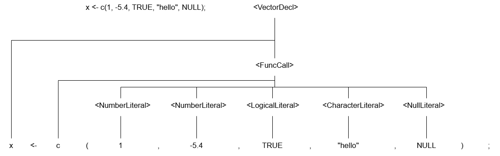  
  
### Формат вывода AST в программе  
AST в виде дерева:  
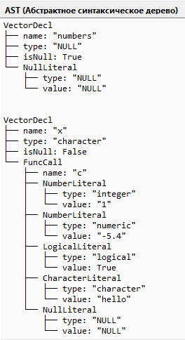  
  
AST в JSON-формате:  
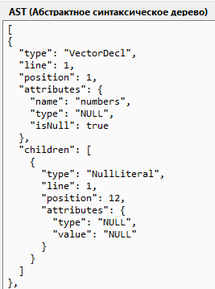  
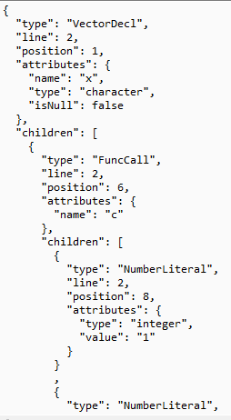  
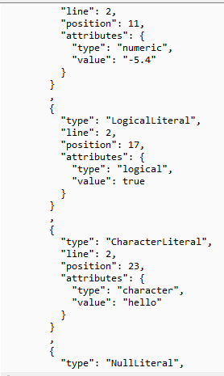  
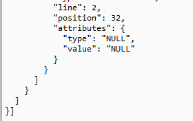  
  
## Тестовые примеры  
### Корректное объявление  
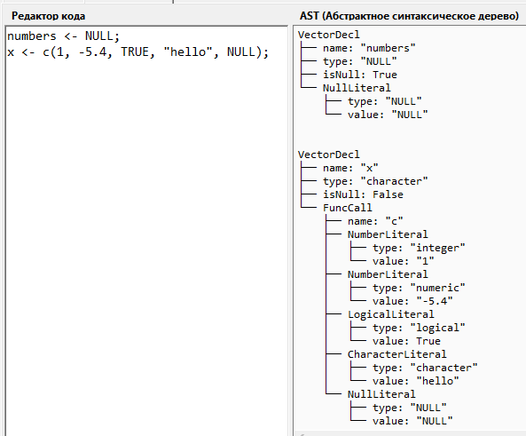  
  
### Повторное объявление того же идентификатора  
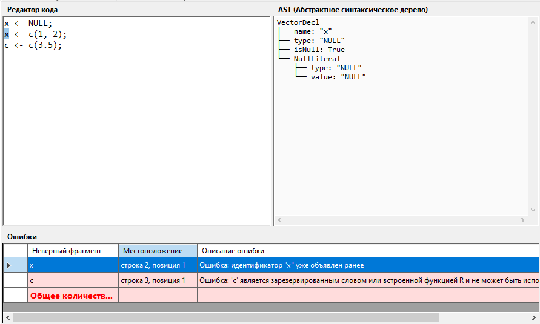  
  
### Несоответствие типа значения объявленному типу  
В данном варианте это не применимо, так как тип вектора определяется автоматически.  
  
### Выход значения за допустимые пределы (для числовых типов)  
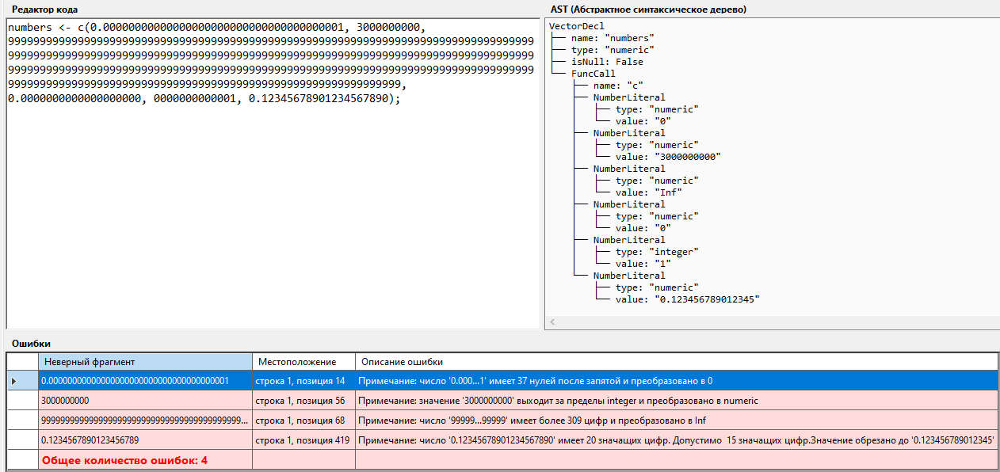  
Примечания не являются ошибками, так как язык использует преобразования для избегания ошибок!  
  
### Использование необъявленного идентификатора в выражении  
В текущей грамматике не применимо, так как внутри с() могут быть только литералы, но не переменные.  
  
## Инструкция по запуску  
### Рекомендации 
Операционная система: Windows 10/11  
.NET Framework: версия 4.7.2 или выше, .NET 10.0  
Среда разработки: Microsoft Visual Studio Insiders/ Visual Studio 2022 (Community edition)  
  
### Компиляция и запуск из Visual Studio  
1. Откройте файл решения editor.sln в среде разработки.  
2. Убедитесь, что в меню «Сборка» → «Диспетчер конфигураций» выбрана конфигурация Debug или Release.  
3. Нажмите Ctrl+B для сборки решения или «Сборка» → «Собрать решение».  
4. Нажмите F5 для запуска с отладкой или Ctrl+F5 для запуска без отладки.  
Приложение откроется в оконном режиме.  
  
### Инструкция по консольной сборке и запуску:  
1. Загрузить проект с github в формате ZIP и расархивировать или клонировать при помощи ссылки.  
2. Открыть командную строку. Нажать Win + R, ввести cmd и нажать Enter.  
3. Перейти в папку проекта  
cd \editor  
5. Собрать проект  
dotnet build  
6. Запустить программу с помощью команды  
dotnet run  
Или перейти в папку с exe-файлом и запустить вручную  
cd bin\Debug\net10.0-windows  
editor.exe  
  
### Используемые технологии  
C# - Язык программирования;  
.NET Framework 4.7.2 / .NET 10.0 - Фреймворк;  
Windows Forms - Графический интерфейс пользователя;  
GDI+ (System.Drawing, System.Drawing.Drawing2D) - Отрисовка графической визуализации AST.  
  
## Дополнительное задание  
### Постановка задачи  
Построенное абстрактное синтаксическое дерево (AST) необходимо визуализировать в графическом виде.  
  
### Требования к реализации  
Каждый узел AST должен отображаться с указанием типа узла и его ключевых атрибутов (например, для ConstDeclNode — имя константы и значение).  
Рёбра должны наглядно показывать иерархическую структуру (родитель — потомок).  
Графическое окно должно открываться по нажатию отдельной кнопки «Показать AST» в интерфейсе редактора.  
  
### Используемые графические средства  
GDI+ (System.Drawing, System.Drawing.Drawing2D) - Отрисовка графической визуализации AST.  
  
### Тестовые примеры  
Пример:    
numbers <- NULL;  
x <- c(1, -5.4, TRUE, "hello", NULL);  
  
Сохраненная визуализация:  
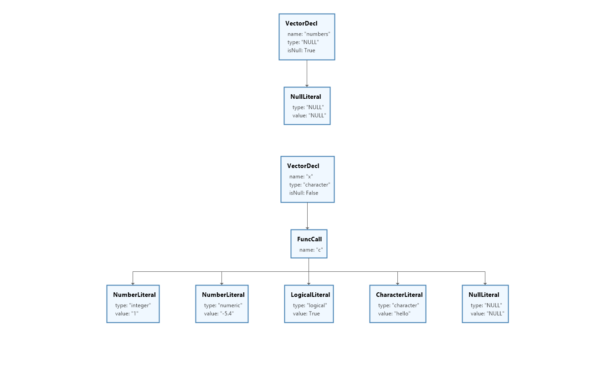  
  
Окно с визуализацией:  
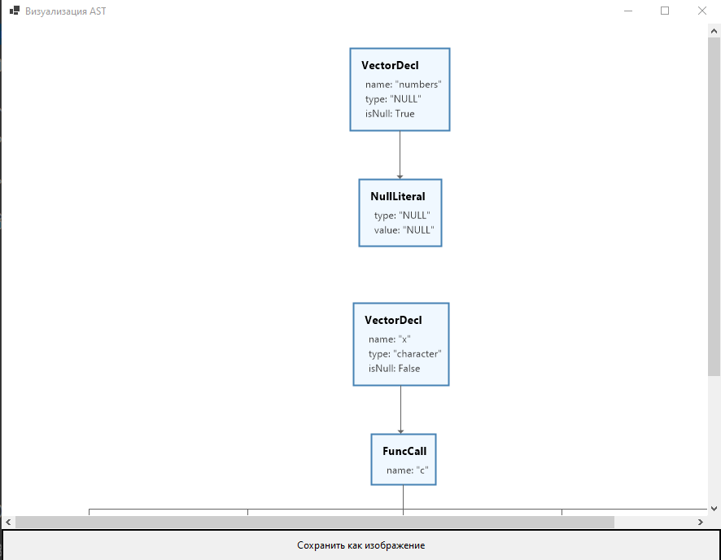  