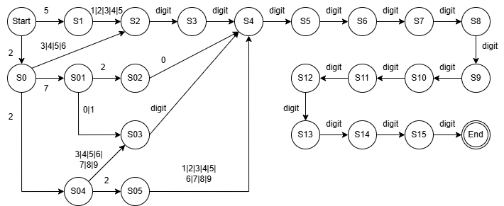

# Лабораторная работа 4. Реализация алгоритма поиска подстрок с помощью регулярных выражений  
  
## Цель работы  
Изучить теоретические основы регулярных выражений и их применение для поиска и извлечения подстрок из текста. Освоить практические навыки использования библиотечных средств работы с регулярными выражениями, а также интеграцию алгоритмов поиска в графический интерфейс приложения.  
   
## Сведения об авторе  
Автор: студентка группы АВТ-314, Лабузова Виктория Витальевна  
   
## Постановка задачи  
Разработать модуль поиска подстрок с использованием регулярных выражений, интегрировать его в существующее приложение (текстовый редактор) и обеспечить наглядный вывод результатов.  
  
## Вариант задания  
14 - Построить РВ для поиска номеров социального страхования США (SSN), которые представляют собой 9-значные номера в формате XXX-XX-XXXX, где каждый X может быть любой цифрой [0-9].  
6 - Построить РВ, описывающее номера карт, принадлежащих платежной системе MasterCard.  
6 - Построить РВ для проверки даты, учитывая високосные годы. Формат даты: MM/DD/YYYY.  
  
## Решение
   
### 1. Социальное строхование США (SSN)  
#### Описание задачи  
Построить РВ для поиска номеров социального страхования США (SSN), которые представляют собой 9-значные номера в формате XXX-XX-XXXX, где каждый X может быть любой цифрой [0-9].  
  
#### Регулярное выражение с пояснением каждого обозначения  
(?=(\d{3})-(\d{2})-(\d{4})), где  
(?= - положительная опережающая проверка, чтение без потребления символов,  
( - начало захватывающей группы,  
\d - десятичная цифра,  
{3} - повтор условия перед фигурной скобкой 3 раза,  
) - конец захватывающей группы,  
"-" - символ дефис,  
( - начало захватывающей группы,  
\d - десятичная цифра,  
{2} - повтор условия перед фигурной скобкой 2 раза,  
) - конец захватывающей группы,  
"-" - символ дефис,  
( - начало захватывающей группы,  
\d - десятичная цифра,  
{4} - повтор условия перед фигурной скобкой 3 раза,  
) - конец захватывающей группы,  
) - конец проверки.  
  
#### Примеры строк, которые должны находиться  
123-45-6789  
987-65-4321  
555-55-5555  
  
#### Примеры строк, которые не должны находиться  
123-456-789  
12-345-6789  
  
#### Тестовые примеры  
  
  
  
### 2. Номера карт MasterCard:  
#### Описание задачи  
Построить РВ, описывающее номера карт, принадлежащих платежной системе MasterCard.  
  
#### Регулярное выражение с пояснением каждого обозначения  
(?=(5[1-5]\d{2}|222[1-9]|22[3-9]\d|2[3-6]\d{2}|27[01]\d|2720)(\d{12})), где  
(?= - положительная опережающая проверка, чтение без потребления символов,  
( - начало группы с альтернативами,  
5 - цифра 5,  
[1-5] - цифра от 1 до 5 включительно,  
\d - десятичная цифра,  
{2} - повтор условия перед фигурной скобкой 2 раза,  
| - альтернатива, допустимы варианты слева и справа (ИЛИ),  
222 - три цифры 2 подряд,  
[1-9] - цифра от 1 до 9 включительно,  
| - альтернатива, допустимы варианты слева и справа (ИЛИ),  
22 - две цифры 2 подряд,  
[3-9] - цифра от 3 до 9 включительно,  
\d - десятичная цифра,  
| - альтернатива, допустимы варианты слева и справа (ИЛИ),  
2 - цифра 2,  
[3-6] - цифра от 3 до 6 включительно,  
\d - десятичная цифра,  
{2} - повтор условия перед фигурной скобкой 2 раза,  
| - альтернатива, допустимы варианты слева и справа (ИЛИ),  
27 - цифры 2 и 7 подряд,  
[01] - цифра 0 или 1,  
\d - десятичная цифра,  
| - альтернатива, допустимы варианты слева и справа (ИЛИ),  
2720 - цифры 2,7,2,0 подряд,  
) - конец группы с альтернативами,  
( - начало захватывающей группы,  
\d - десятичная цифра,  
{12} - повтор условия перед фигурной скобкой 12 раз,  
) - конец проверки.  
  
#### Примеры строк, которые должны находиться  
5112345678901234  
5500000000000004  
2221001234567890  
5423456789012345  
  
#### Примеры строк, которые не должны находиться  
4111111111111111  
2202333344445555  
  
#### Тестовые примеры (скриншоты)  
  
  
#### Граф автомата  
  
  
  
### 3. Даты:  
#### Описание задачи  
Построить РВ для проверки даты, учитывая високосные годы. Формат даты: MM/DD/YYYY.  
  
#### Регулярное выражение с пояснением каждого обозначения  
(?=((?:(?:0[13578]|1[02])/(?:0[1-9]|[12]\d|3[01])|(?:0[469]|11)/(?:0[1-9]|[12]\d|30)|02/(?:0[1-9]|1\d|2[0-8]))/\d{4}|02/29/(?:(?:\d{2}(?:0[48]|[2468][048]|[13579][26]))|(?:[02468][048]00|[13579][26]00))))  
(?= - положительная опережающая проверка, чтение без потребления символов,  
( - начало захватывающей группы,  
( - начало группы с альтернативами,  
?: - не запоминать содержимое группы,  
( - начало группы с альтернативами,  
?: - не запоминать содержимое группы,  
0 - цифра 0,  
[13578] - цифра или 1, или 3, или 5, или 7, или 8,  
| - альтернатива, допустимы варианты слева и справа (ИЛИ),  
1 - цифра 1,  
[02] - цифра 0 или 2,  
) - конец группы с альтернативами,  
/ - разделитель между месяцем и днем,
( - начало группы с альтернативами,  
?: - не запоминать содержимое группы,  
0 - цифра 0,  
[1-9] - цифра от 1 до 9 включительно,  
| - альтернатива, допустимы варианты слева и справа (ИЛИ),  
[12] - цифра 1 или 2,  
\d - десятичная цифра,  
| - альтернатива, допустимы варианты слева и справа (ИЛИ),  
3 - цифра 3,  
[01] - цифра 0 или 1,  
) - конец группы с альтернативами,  
| - альтернатива, допустимы варианты слева и справа (ИЛИ),  
( - начало группы с альтернативами,  
?: - не запоминать содержимое группы,  
0 - цифра 0,  
[469] - цифра или 4, или 6, или 9,  
| - альтернатива, допустимы варианты слева и справа (ИЛИ),  
11 - цифры 1 и 1 подряд,  
) - конец группы с альтернативами,  
/ - разделитель между месяцем и днем,  
( - начало группы с альтернативами,  
?: - не запоминать содержимое группы,  
0 - цифра 0,  
[1-9] - цифра от 1 до 9 включительно,  
| - альтернатива, допустимы варианты слева и справа (ИЛИ),  
[12] - цифра 1 или 2,  
\d - десятичная цифра,  
| - альтернатива, допустимы варианты слева и справа (ИЛИ),  
30 - цифры 3 и 0 подряд,  
) - конец группы с альтернативами,  
| - альтернатива, допустимы варианты слева и справа (ИЛИ),  
02 - цифры 0 и 2 подряд,  
/ - разделитель между месяцем и днем,  
( - начало группы с альтернативами,  
?: - не запоминать содержимое группы,  
0 - цифра 0,  
[1-9] - цифра от 1 до 9 включительно,  
| - альтернатива, допустимы варианты слева и справа (ИЛИ),  
1 - цифра 1,  
\d - десятичная цифра,  
| - альтернатива, допустимы варианты слева и справа (ИЛИ),  
2 - цифра 2,  
[0-8] - цифра от 0 до 8 включительно,  
) - конец группы с альтернативами,  
) - конец группы с альтернативами,  
/ - разделитель между днем и годом,  
\d - десятичная цифра,  
{4} - повтор условия перед фигурной скобкой 4 раза,  
| - альтернатива, допустимы варианты слева и справа (ИЛИ),  
02/29/ - несколько символов идущих друг за другом,  
( - начало группы с альтернативами,  
?: - не запоминать содержимое группы,  
( - начало группы с альтернативами,  
?: - не запоминать содержимое группы,  
\d - десятичная цифра,  
{2} - повтор условия перед фигурной скобкой 2 раза,  
( - начало группы с альтернативами,  
?: - не запоминать содержимое группы,  
0 - цифра 0,  
[48] - цифра 4 или 8,  
| - альтернатива, допустимы варианты слева и справа (ИЛИ),  
[2468] - цифра или 2, или 4, или 6, или 8,  
[048] - цифра или 0, или 4, или 8,  
| - альтернатива, допустимы варианты слева и справа (ИЛИ),  
[13579] - цифра или 1, или 3, или 5, или 7, или 9,  
[26] - цифра 2 или 6,  
) - конец группы с альтернативами,  
) - конец группы с альтернативами,  
| - альтернатива, допустимы варианты слева и справа (ИЛИ),  
( - начало группы с альтернативами,  
?: - не запоминать содержимое группы,  
[02468] - цифра или 0, или 2, или 4, или 6, или 8,  
[048] - цифра или 0, или 4, или 8,  
00 - две цифры 0 подряд,  
| - альтернатива, допустимы варианты слева и справа (ИЛИ),  
[13579] - цифра или 1, или 3, или 5, или 7, или 9,  
[26] - цифра 2 или 6,  
00 - две цифры 0 подряд,  
) - конец группы с альтернативами,  
) - конец группы с альтернативами,  
) - конец захватывающей группы,  
) - конец проверки.  
  
#### Примеры строк, которые должны находиться  
01/15/2023  
12/25/2024  
02/29/2020  
11/11/2023  
  
#### Примеры строк, которые не должны находиться  
13/01/2023  
02/30/2023  
  
#### Тестовые примеры (скриншоты)  
  