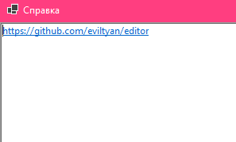
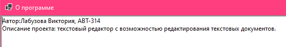

# editor
Лабораторная работа 1. Разработка пользовательского интерфейса (GUI) для языкового процессора.  
  
Автор:Лабузова Виктория, АВТ-314.  
  
Описание проекта: текстовый редактор с возможностью редактирования текстовых документов.  
  
Используемые технологии: C#, WinForms.  
  
Описание интерфейса и инструкций:  
1) Файл  
a. Создать  
Создает новый текстовый документ.  
  
  
  
  
b. Открыть  
Открывает текстовый документ в новой вкладке.  
  
  
  
  
c. Сохранить  
Сохраняет изменения в документе. Если файл новый, то открывается меню сохранения нового документа.  
  
  
  
  
d. Сохранить как  
Открывает меню для сохранения нового документа с именем и расположением, выбранным пользователем.  
  
  
  
e. Выход  
Закрывает программу. При наличии несохраненных изменений предлагает сохранить каждый файл.  
  
  
2) Правка  
a. Отменить  
Отменяет внесенное изменение в файле.  
  
  
  
b. Вернуть  
Возвращает отмененное изменение.  
  
  
  
c. Вырезать  
Вырезает выделенный текст, копируя его в буфер.  
  
  
  
d. Копировать  
Копирует выделенный текст в буфер.  
  
  
  
e. Вставить  
Вставляет скопированный или вырезанный текст из буфера.  
  
  
  
f. Отменить все изменения  
Отменяет все изменения, возвращая файл к исходному виду.  
  
  
  
g. Выделить все  
Выделяет весь текст в окне для редактирования текста.  
  
  
3) Справка  
a. Вызов справки  
Открывает окно с ссылкой на справку, а также открывает ссылку в браузере.  
  
  
  
b. О программе  
Открывает окно с информацией о программе.  
  
  
  
Ограничения: хранение до 100 изменений на документ.  