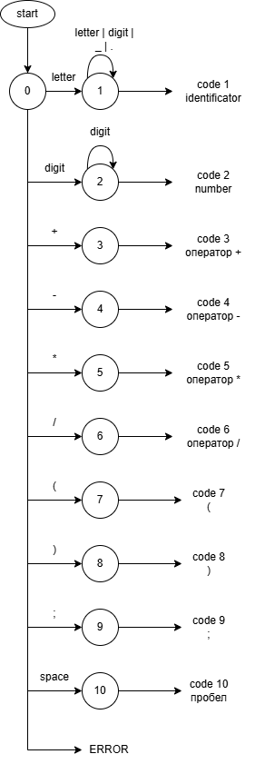
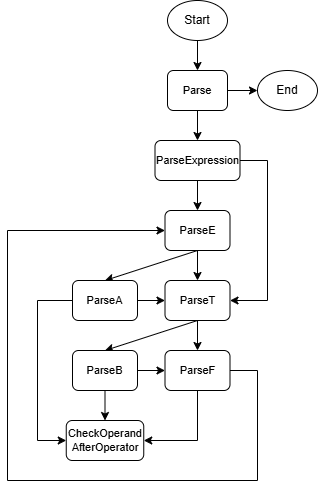

# Лабораторная работа 6. Создание внутренней формы представления программы  
  
## Цель работы  
Изучить методы построения внутреннего представления программы (ВПП) на основе контекстно-свободной грамматики, реализовать синтаксический анализатор методом рекурсивного спуска и преобразовать арифметические выражения в тетрады и ПОЛИЗ.  
  
## Сведения об авторе  
Автор: студентка группы АВТ-314, Лабузова Виктория Витальевна  
  
## Постановка задачи  
1. Реализовать поиск лексических и синтаксических ошибок для заданной КС-грамматики методом рекурсивного спуска.  
  
2. Представить внутреннюю форму программы в виде тетрад (op, arg1, arg2, result) для арифметических выражений (только для корректных строк).  
  
3. Преобразовать выражение в ПОЛИЗ (польскую инверсную запись) и вычислить его значение (только арифметическое выражение из целых чисел).  
  
## Вариант задания  
### Язык программирования:  
Язык R.  
  
### Определение КС-грамматики:  
```
G = (VN, VT, P, Z)
G[<Z>]:
•	Z = <Expression>;
•	VT = {a, b, c, ..., z, A, B, C, ..., Z,  , _ , . , ; , +, - , * , / , 0, 1, 2, ..., 9};
•	VN = {<Expression>, <Addition>, <Term>, <Multiplication>, <Factor>, <Identificator>, <Number>}.
•	P:
1. <Expression> → <Term> <Addition> “;”
2. <Addition> → ε | “+” <Term> <Addition> | “-” <Term> <Addition>
3. <Term> → <Factor> <Multiplication>
4. <Multiplication> → ε | “*” <Factor> <Multiplication> | “/” <Factor> <Multiplication>
5. <Factor> → <Number> | <Identificator> | (<Expression>)
6. <Identificator> → letter {letter | digit | “_” | “.”}
7. <Number> → digit {digit}

letter → “a” | “b” | ... | “z” | “A” | ... | “Z”
digit → “0” | “1” | ... | “9”
```
  
### Корректные входные строки:  
100 + 5 - 10;  
  
10 - 2 * num.1 / 4 + num_2;  
  
(a+b)/(a-c*10)+abc;  
  
## Лексические и синтаксические ошибки  
### Диаграмма лексера:  
  
  
### Схема рекурсивного спуска для парсера:  
  
  
### Тестовые примеры для лексера  
#### Строка без ошибок:  
;  
1+2-3*(4+5)/2+100 ;  
  
  
  
#### Строка с ошибками:  
x^y;  
3 # 4;  
  
  
  
### Тестовые примеры для парсера  
#### Строка без ошибок:  
1+2-3*(4+5)/2+100 ;  
  
  
  
#### Строка с ошибками:  
1 + №№ * 3 / 4;   
2 3 * + 8;  
1 +3 3333 & / 4;  
(2 + );  
( + 3);  
2 (3 + 4);  
  
  
  
## Внутренняя форма представления программы  
### Тетрады:  
  
  
## Польская инверсная запись (ПОЛИЗ)  
### Формирование ПОЛИЗ и вычисление арифметического выражения:  
  