# Лабораторная работа 7. Анализ и преобразование кода с использованием Clang и LLVM  
  
## Цель работы  
Познакомиться с инструментарием Clang и LLVM, освоить получение абстрактного синтаксического дерева (AST) и промежуточного представления (LLVM IR) для кода на C/C++, научиться применять базовые оптимизации, строить графы потока управления (CFG), а также анализировать влияние оптимизаций на различные синтаксические конструкции языка.  
  
## Сведения об авторе  
Автор: студентка группы АВТ-314, Лабузова Виктория Витальевна  
  
## Постановка задачи  
### Общее задание
1. Установка среды  
Установить Clang, LLVM, opt и Graphviz.  
  
2. Работа с AST  
Сгенерировать абстрактное синтаксическое дерево для заданного C/C++‑файла.  
  
3. Генерация LLVM IR  
Получить промежуточное представление кода без оптимизаций (-O0) и с оптимизациями (-O2).  
  
4. Оптимизация IR  
Применить оптимизации с помощью opt и/или флагов Clang, сравнить изменения.  
  
5. Построение CFG  
Построить граф потока управления для одной или нескольких функций.  
  
6. Индивидуальное задание (по варианту)  
Выполнить анализ конкретной синтаксической конструкции в соответствии с вариантом. Сформулировать, как LLVM обрабатывает выбранную конструкцию, какие оптимизации применяются.  
  
7. Выводы  
Ответить на контрольные вопросы  
  
### Индвидуальное задание  
1. Получить IR для -O0 и -O2.  
  
2. Исследовать, разворачивается ли цикл (-unroll).  
  
3. Построить CFG для main с -O0 и с -O2.  
   
4. Применить дополнительно -loop-rotate, -licm и описать изменения.  
  
5. Сделать вывод о том, какие оптимизации применились к массиву и циклу.  
  
## Общее задание  
### Работа с AST  
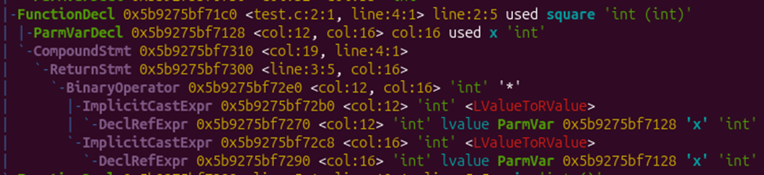  
  
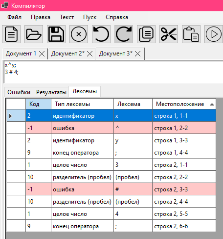  
  
### Генерация LLVM IR  
  
  
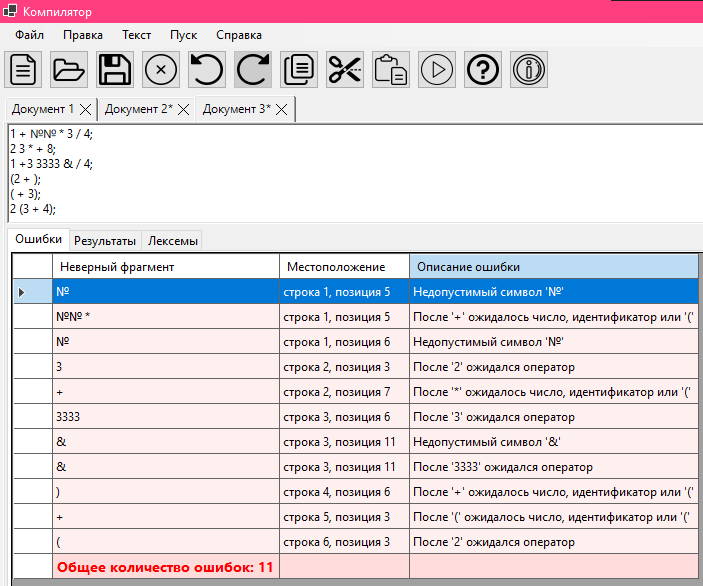  
  
### Оптимизация IR  
#### -O0 оптимизация  
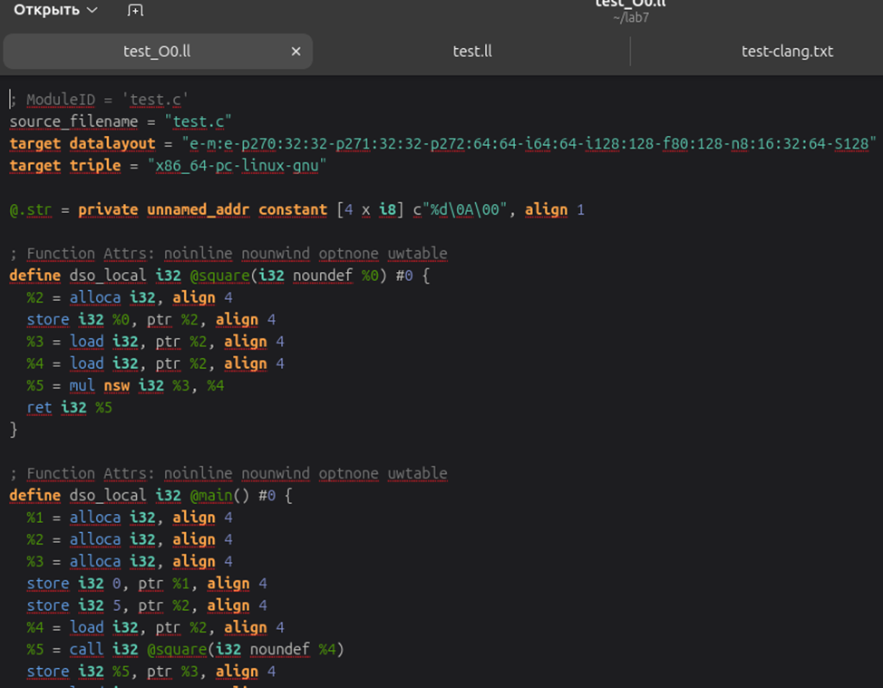  
  
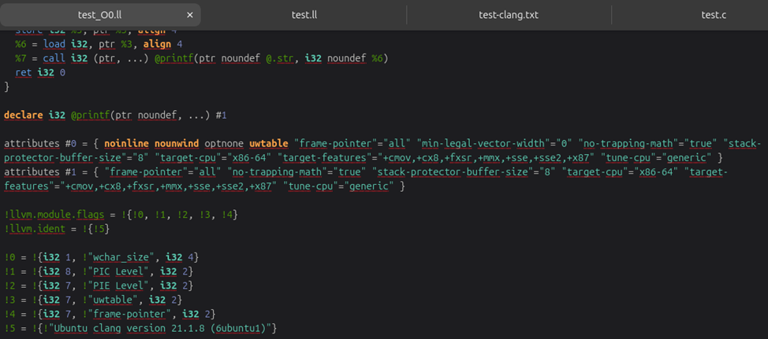  
  
#### -O2 оптимизация  
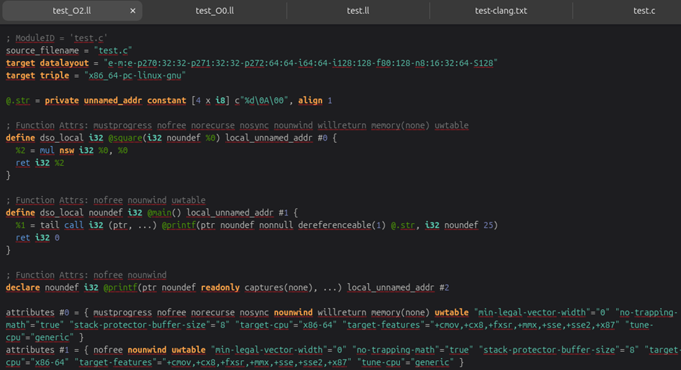  
  
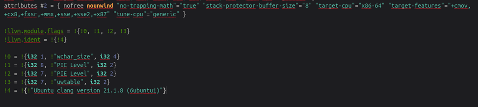  
  
### Построение CFG  
#### -O0 оптимизация  
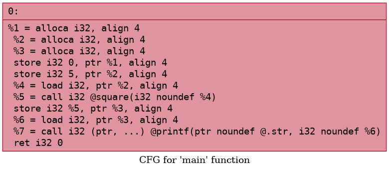  
  
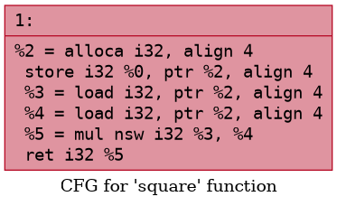  
  
#### -O2 оптимизация  
  
  
  
  
### Вывод по общему заданию  
1.	С помощью Clang удалось получить AST-дерево, которое наглядно показывает структуру программы (функции, операции, переменные).  
  
2.	LLVM IR в режиме -O0 содержит множество инструкций alloca, load/store, что делает его неоптимизированным, но удобным для анализа.  
  
3.	После применения -O2 произошли следующие изменения:  
•	Исчезли alloca - переменные стали храниться в регистрах (SSA-форма);  
•	Исчезли load/store, остались add/mul;  
•	Функция square была встроена (inlined) в main и заменена выражением;  
•	Количество инструкций сократилось;  
•	Значения выражений рассчитаны на этапе компиляции;   
•	Для экономии памяти использованы константы.  
  
4.	Построенные CFG-графы наглядно показывают упрощение потока управления после оптимизаций: в -O2 граф стал содержать меньше инструкций.  
  
5.	Инструменты LLVM предоставляют гибкие возможности для анализа и оптимизации кода на разных уровнях представления.  
  
## Индивидуальное задание  
### Вариант задания  
2.3 Списки / массивы / словари  
Пример кода:  
```
#include <iostream>
#include <array>
int main() 
{ 
    std::array data = {1, 2, 3, 4, 5}; 
    int sum = 0; 
    for (int i = 0; i < data.size(); ++i) 
    { 
        sum += data[i]; 
    }    
    std::cout << sum << std::endl; 
    return 0; 
}  
```
  
### Анализ синтаксической конструкции  
#### AST  
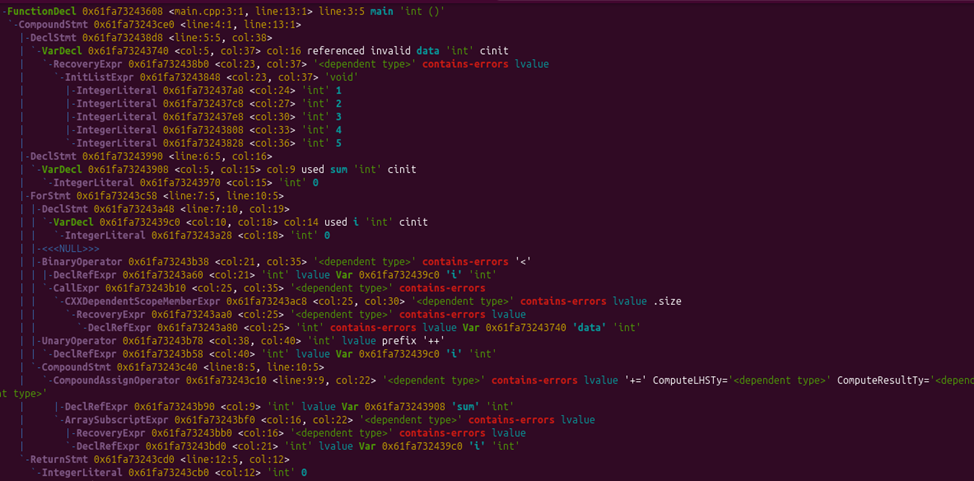  
  
#### IR для -O0 и -O2  
#### -O0 оптимизация  
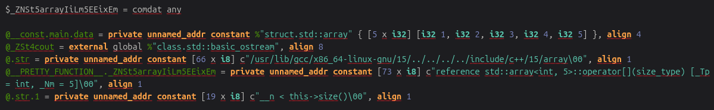  
  
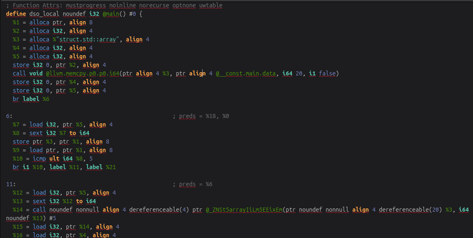  
  
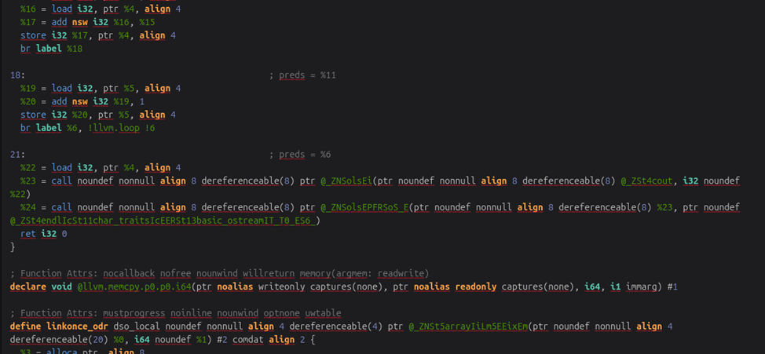  
  
main_O0.ll, неоптимизированная версия:  
1.	Массив data из 5 элементов.  
%3 = alloca %struct.std::array, align 4 - место под массив.  
memcpy из константных данных @__const.main.data, где лежат числа 1,2,3,4,5.  
2. Переменная sum = 0. store i32 0, ptr %4, align 4.  
3. Цикл for: инициализация i (store i32 0, ptr %5), проверка условия (блок 6), тело (блок 11) - сложение, инкремент (блок 18).  
4. Вывод через std::cout: вызов _ZNSolsEi (оператор << для int) и endl.  
  
#### -O2 оптимизация  
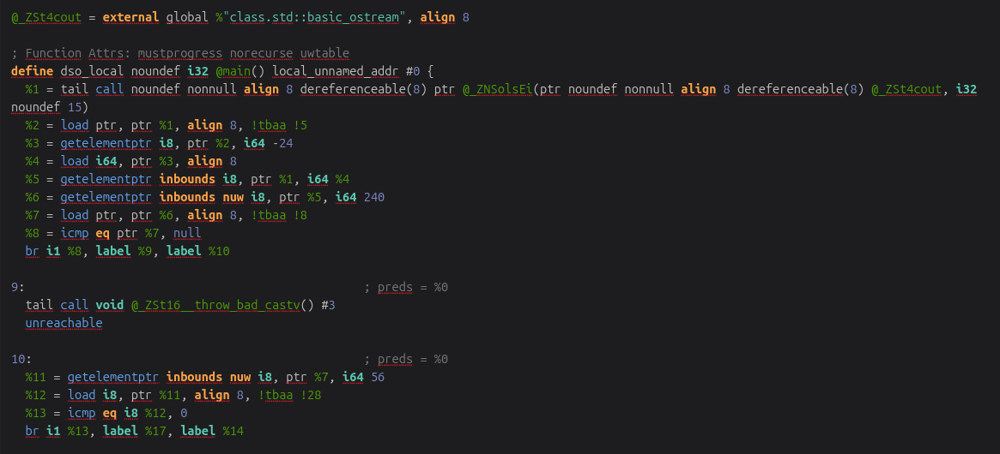  
  
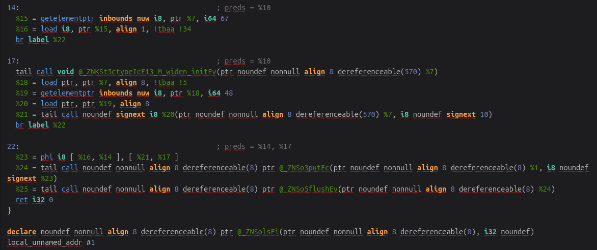  
  
main_O2.ll, оптимизированная версия:  
1. Компилятор вычислил сумму на этапе компиляции: 1+2+3+4+5 = 15, сразу передал её в cout.  
2. Все переменные и циклы исчезли.  
3. Нет массива и operator[].  
4. Есть прямой вызов _ZNSolsEi с константой 15.  
  
#### Итог по IR  
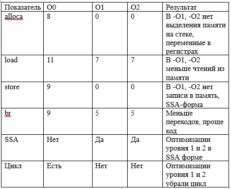  
  
IR соответствует ожиданиям. В неоптимизированной версии отражён код. В оптимизированной версии сохранен результат с меньшим количеством операций. Выражения заменены на константные значения, цикл отсутствует, переменные отсутствуют - значения подставлены заранее.    
  
#### Развертка цикла (-unroll)  
При использовании opt -passes=loop-unroll имеем следующие результаты:  
Для файла с -O0 оптимизацией:  
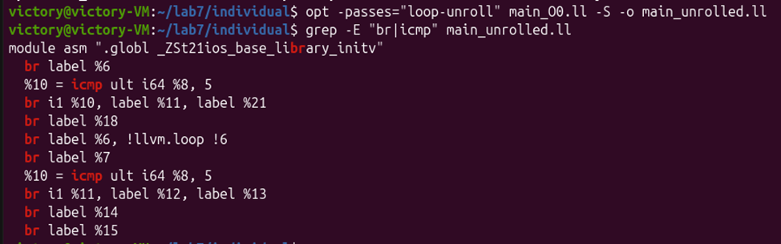  
  
Для файла с -O1 оптимизацией:  
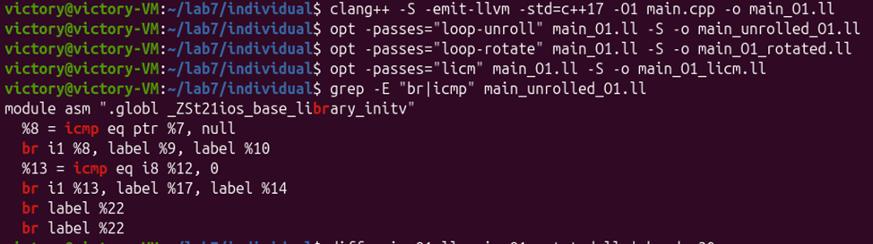  
  
Для файла с -O2 оптимизацией:  
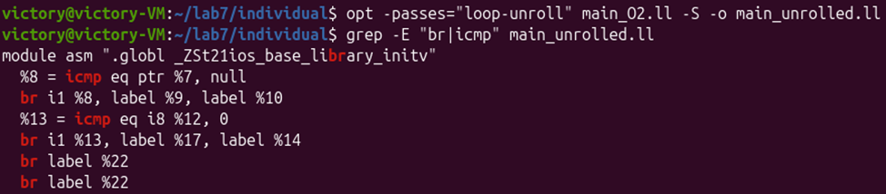  
  
В main_unrolled.ll с -O0 оптимизацией остались инструкции br и icmp, блоки 6, 11, 21, значит, цикл не развернулся полностью. В main_unrolled.ll с -O1/-O2 оптимизацией цикл отсутствует.  
  
При использовании clang цикл был полностью удален из-за сворачивания констант (constant folding) на уровне -O1. Компилятор вычислил сумму элементов массива на этапе компиляции. Разницы между -O1 и -O2 для этого кода нет - все ключевые оптимизации применились уже на -O1.  
  
LLVM эффективно устраняет циклы с константными границами и операциями, если результат может быть вычислен на этапе компиляции (свёртка констант).  
Разворот цикла (unroll) применим только к циклам, не удалённым другими оптимизациями, где итерации не могут быть свёрнуты (например, данные поступают из внешнего источника - аргументы командной строки или ввод пользователя).  
  
#### CFG  
#### -O0 оптимизация  
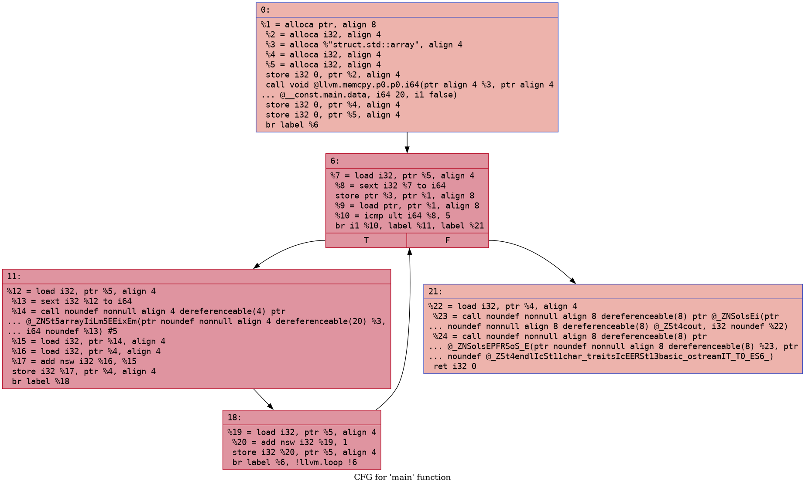  
  
main:  
Блок 0: инициализация. Создаются переменные, вызывается memcpy для копирования массива.  
Блок 6: условие цикла. Сравнение i < 5. Если истина (T) - переход к телу (блок 11), если ложь (F) - к выводу (блок 21).  
Блок 11: тело цикла. Вычисляется data[i] через operator[], прибавляется к sum.  
Блок 18: инкремент i и переход назад к условию.  
Блок 21: вывод суммы и выход.  
  
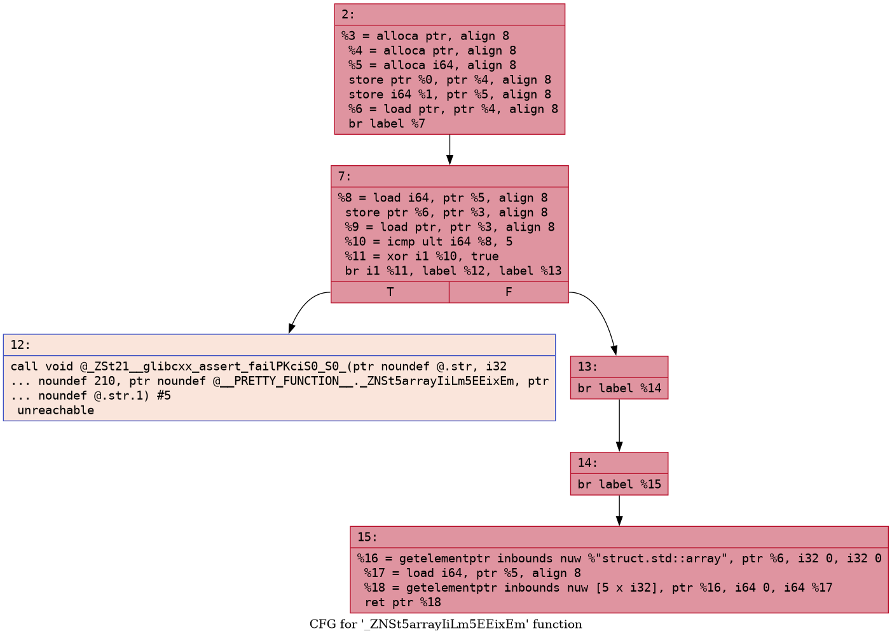  
  
Оператор:  
CFG для стандартной функции operator[] без оптимизаций.  
Проверка границ (блок 7), ветвление на ошибку (блок 12) и корректное вычисление адреса элемента (блок 15).  
  
#### -O2 оптимизация  
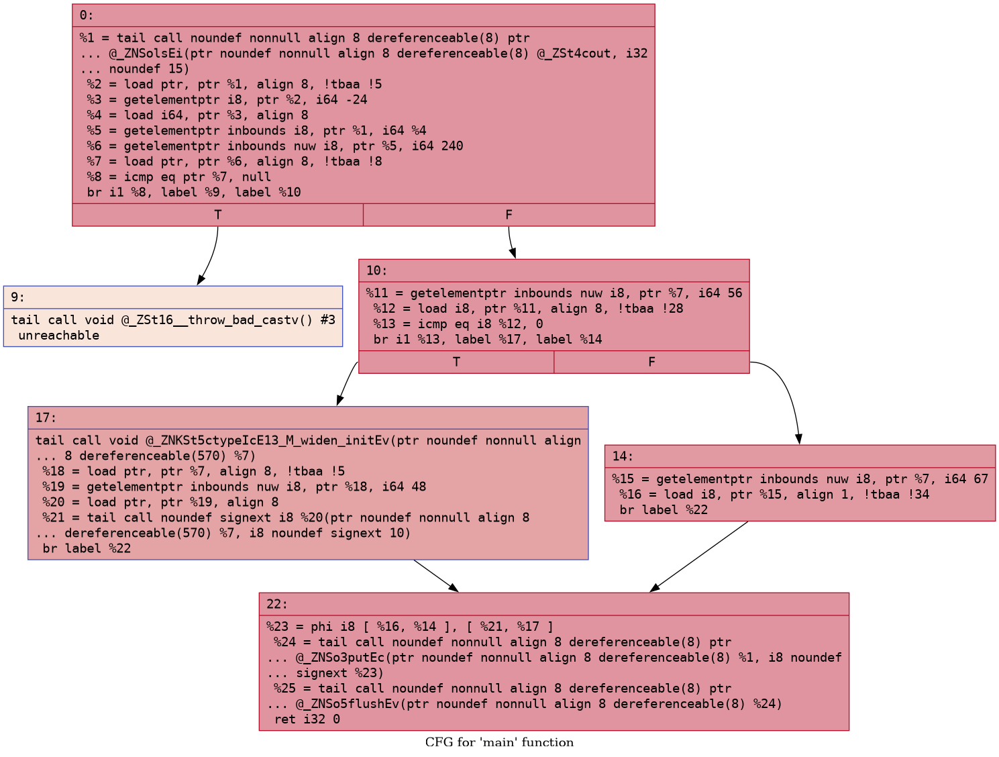  
  
main:  
Компилятор полностью вычислил сумму на этапе компиляции, поэтому цикла нет.  
Входной блок: прямая печать числа 15 в cout.  
Затем идёт серия проверок: что с потоком, нужно ли расширить символ, вызываются служебные функции pour flush.  
Блоки с ветвлениями (if) - обработка флагов и типов (например, проверка, не нужно ли расширить символ новой строки).  
  
#### Итог по CFG  
1. Без оптимизаций (-O0):  
•	Массив data инициализируется через memcpy из константных данных.  
•	Суммирование реализовано явным циклом for, который развёрнут в IR в виде блоков: инициализация, проверка условия, тело, инкремент.  
•	Доступ к элементам массива происходит через вызов operator[], который выполняется на каждой итерации.  
•	Все переменные хранятся в стеке через инструкции alloca, что приводит к множеству load/store.  
Вывод: IR полностью отражает код на C++, но содержит много служебных операций и проверок.  
  
2. С оптимизациями (-O2):  
•	Компилятор вычислил сумму элементов массива на этапе компиляции (5 + 4 + 3 + 2 + 1 = 15).  
•	Цикл for и вызовы operator[] полностью удалены.  
•	Вместо массива и цикла прямой вызов std::cout с константным значением 15.  
•	Код стал линейным, без ветвлений и итераций.  
Вывод: LLVM применил свёртку констант, удаление мёртвого кода и встраивание, что повысило производительность.  
  
CFG main без оптимизации - это отражение кода. CFG main с оптимизацией - это техническая работа с потоками ввода-вывода. Для -O2 не создался файл для operator[], потому что на уровне оптимизации -O2 этот метод был встроен (inlined). Если он встроен, то у него нет своей функции в IR, и opt не генерирует для него CFG.  
  
#### Анализ -loop-rotate, -licm  
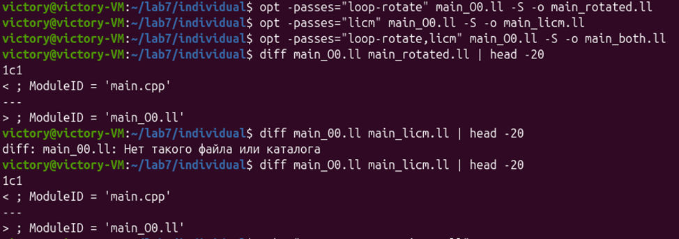  
  
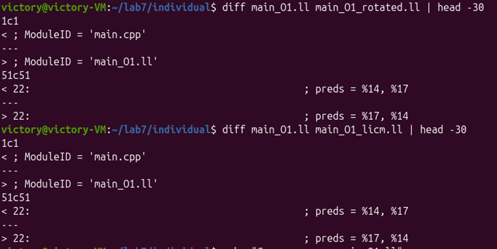  
  
-loop-rotate: Не привел к изменениям в IR (кроме технического заголовка), так как исходный цикл уже был в канонической форме.  
-licm: Не привел к изменениям в IR, поскольку инвариантное выражение data.size() уже было заменено на константу 5 на более ранних этапах оптимизации.  
  
Вывод:  
Для данного кода оптимизации -loop-rotate и -licm избыточны, так как их работа уже выполнена базовыми уровнями оптимизации.  
  
### Выводы  
#### Применённые оптимизации:  
Inlining (встраивание): Метод std::array::operator[] был встроен в тело цикла, что подтверждается отсутствием его вызова в -O2 и отсутствием отдельного CFG для этого метода.
Constant propagation (распространение констант): Вызов data.size() заменен на константу 5, так как размер массива известен на этапе компиляции.
Преобразование в SSA-форму: В -O2 полностью отсутствуют инструкции alloca и store, все переменные представлены в виде SSA-регистров.
Упрощение потока управления: Количество инструкций условного перехода (br) сократилось с 9 до 5, что упростило CFG.
Loop unrolling (развертывание цикла): Полное развертывание цикла не произошло, так как LLVM посчитала его нецелесообразным для 5 итераций.
  
#### Итоговый вывод по индивидуальному заданию:
LLVM эффективно оптимизирует контейнер std::array и цикл for, если все данные известны на этапе компиляции. В этом случае высокоуровневая конструкция C++ заменяется на готовое константное значение, а вся конструкция цикла и доступа к элементам удаляется, что приводит к максимально быстрому коду.  
  
## Дополнительное задание  
### Постановка задачи  
1. Построить абстрактное синтаксическое дерево (AST) конструкции (из лабораторной работы 5).  
  
2. Сгенерировать промежуточное представление (IR) для данной конструкции в виде трехадресного кода (TAC) или списка виртуальных инструкций или канонической строковой формы (упрощённый вариант для одной строки).  
  
3. Реализовать две локальные оптимизации. Каждая оптимизация должна преобразовывать IR к эквивалентному, но более простому или каноническому виду.  
  
4. Продемонстрировать работу оптимизаций на конкретных примерах: показать «входной IR» и «выходной IR» после применения каждой оптимизации.  
  
5. Все пункты 1-4 должны быть внедрены в GUI программы с КР/РГР (продолжение ЛР 5).  
  
### AST конструкции  
  
### Промежуточное представление IR  
Для промежуточного представления использовались следующие виртуальные инструкции:  
CONST - создание константы (число, строка, логическое значение, NULL) и сохранение её во временную переменную.  
  
LIST - создание пустого списка для хранения аргументов функции.  
  
ADD_ARG - добавление одного аргумента в список аргументов.  
  
CALL - вызов функции (в нашем случае функции c) с переданным списком аргументов.  
  
VECTOR - прямое создание вектора указанного типа и размера (без вызова функции).  
  
SET_ELT - установка значения элемента вектора по индексу.  
  
FREE - освобождение памяти временных переменных, констант и списков после использования.  
  
Присваивание (=) - запись значения (результата вычислений) в переменную.  
  
### Оптимизации  
### Оптимизация 1: Удаление NULL  
#### Текстовое описание  
В языке R функция c() при создании вектора игнорирует значения NULL. Оптимизация удаляет все аргументы NULL из списка аргументов функции c(). Результат выполнения программы не меняется, так как NULL-значения игнорируются. Применяется в конструкциях вида  vec <- c(..., NULL, ...).  
  
#### Преимущества:  
•	Сокращение количества аргументов функции  
•	Уменьшение числа операций ADD_ARG  
•	Экономия памяти при выполнении  
•	Упрощение последующего анализа типов  
  
#### Блок-схема  
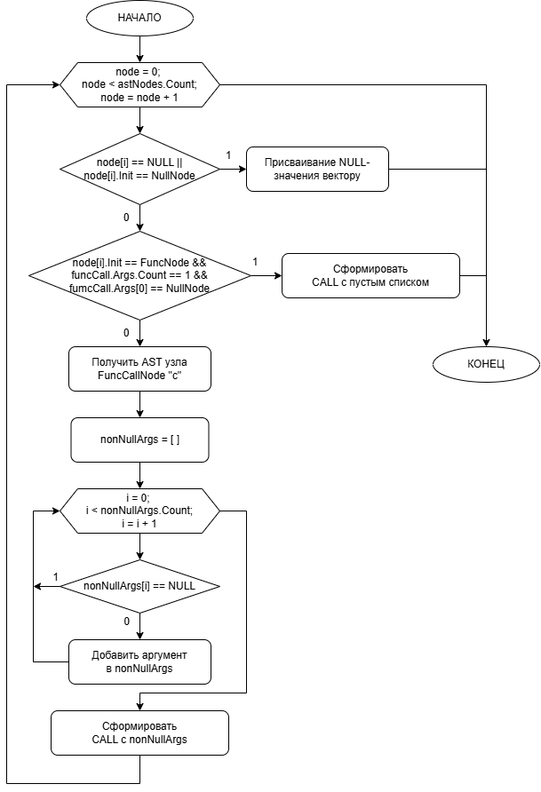  
  
### Оптимизация 2: Приведение к общему типу  
#### Текстовое описание  
Приведение аргументов к общему типу (Coercion / Canonicalization). Вектор в R может хранить элементы только одного типа. При смешении разных типов все элементы приводятся к наиболее "гибкому" типу по иерархии: NULL < logical < integer < double < character. Оптимизация выполняет это приведение и заменяет вызов c() на прямое создание вектора. Применяется в конструкциях вида vec <- c(1, TRUE, "hello") со смешанными типами.  
  
#### Преимущества:  
•	Устранение вызова функции c() во время выполнения  
•	Уменьшение числа операций (нет LIST, ADD_ARG, CALL)  
•	Все преобразования типов выполняются один раз на этапе компиляции  
•	Прямое выделение памяти под вектор нужного типа  
  
#### Блок-схема  
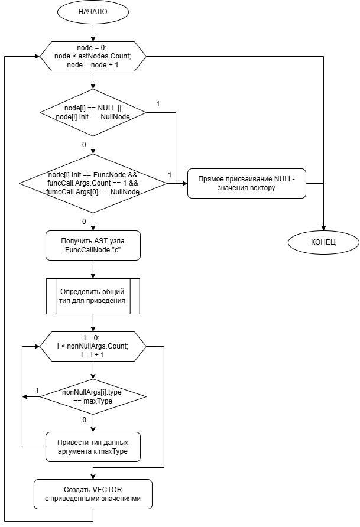  
  
### Оптимизация 3: Упрощение выражений  
#### Текстовое описание  
Упрощение выражений / удаление мертвого кода (Expression Simplification / Dead Code Elimination). При присваивании переменной значения NULL или при вызове c() без аргументов (вызов в итоге возвращает NULL) можно упростить IR, удалив временные переменные и операции с ними. Применяется в конструкциях вида x <- NULL и x <- c(NULL) (после оптимизации 1 превращается в c()).  
  
#### Преимущества:  
•	Удаление временных переменных t1, args  
•	Удаление операций FREE  
•	Упрощение кода до прямого присваивания x = NULL  
  
#### Блок-схема  
Оптимизация 3 в данном случае является частным случаем оптимизации 2 и показана в блок-схеме второй оптимизации. После проверки на присваивание вектору NULL-значения и проверки на вызов функции с единственным NULL-аргументом происходит прямое присваивание NULL-значения вектору.
  
### Тестовые примеры  
#### Пример с несколькими NULL  
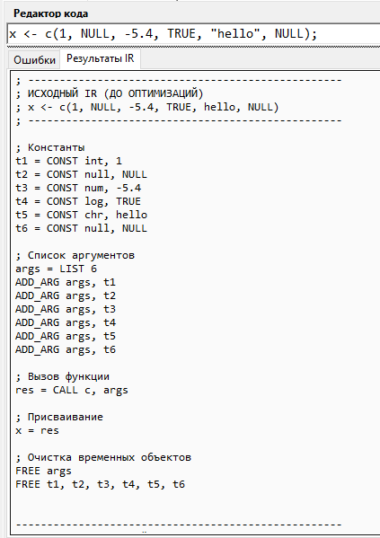  
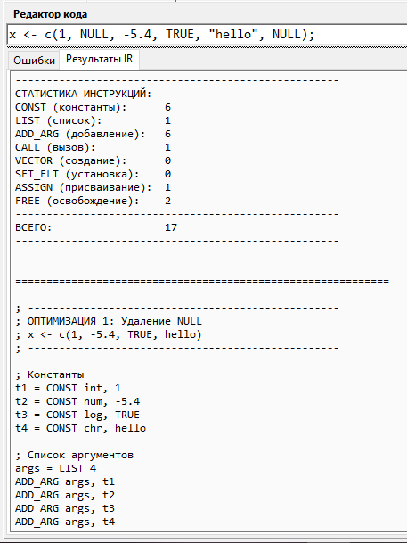  
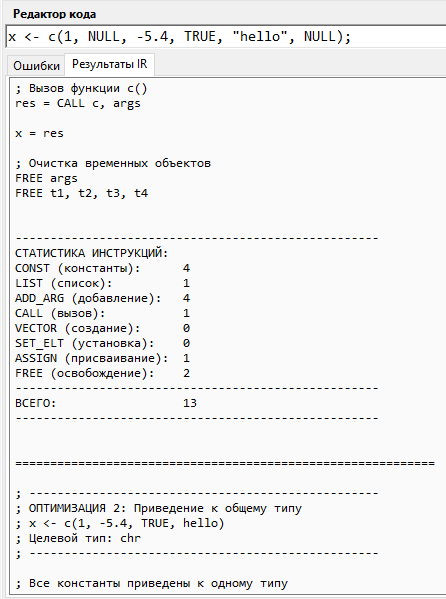  
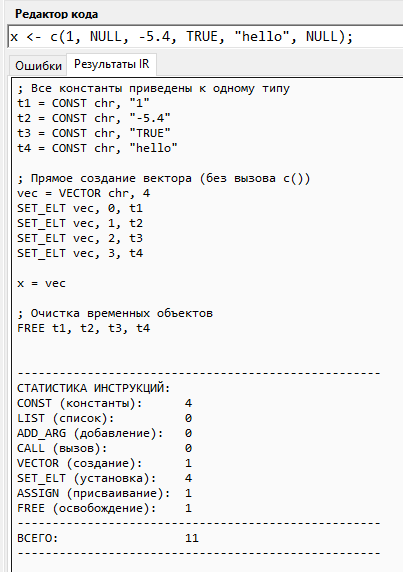  
  
#### Пример с NULL в функции  
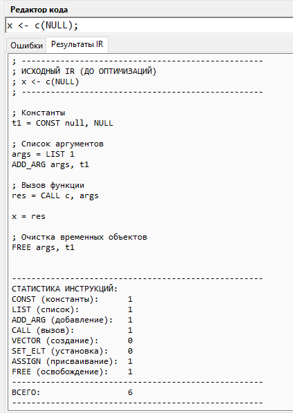  
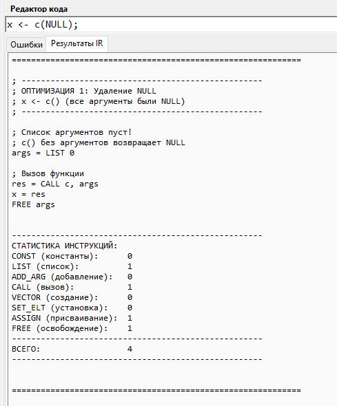  
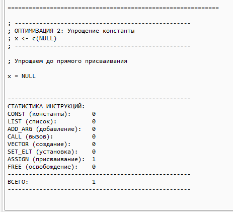  
  
#### Пример с присваиванием NULL  
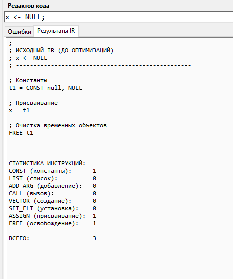  
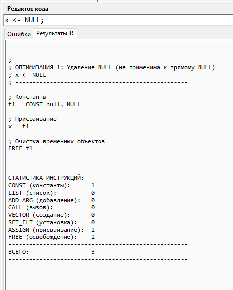  
  